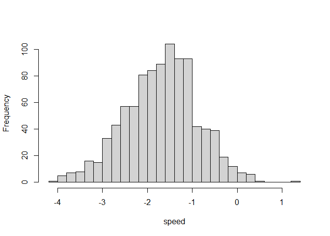

sbd
================

## Size Biased Distributions

An R package for fitting and plotting size-biased non-negative
distributions. Size-biased distributions occur when the probability of
observing something is proportional to its size. The example motivating
this package is observations of animal speeds made by camera traps,
where faster moving animals are more likely to encounter camera traps
and hence be recorded, with probability of observation expected to be
proportional to speed ([Rowcliffe et
al. 2016](https://zslpublications.onlinelibrary.wiley.com/doi/full/10.1002/rse2.17)).

The core function is `sbm`, which performs model fitting and estimates
the underlying average of a set of size biased data, given a model
formula and a dataframe containing the variables named in the formula.
Default usage is non-parametric, providing the harmonic mean as the
estimator of underlying average:

``` r
library(sbd)
data("BCI_speed_data")
agoutiData <- subset(BCI_speed_data, species=="agouti")
mod <- sbm(speed~1, agoutiData)
mod
```

    ## Call:
    ## speed ~ 1
    ## 
    ## Probability distribution:
    ## none
    ## 
    ## Estimates:
    ##         est          se       lcl       ucl
    ## 1 0.1322636 0.004164446 0.1241013 0.1404259

The distribution can be plotted using the `hist` method:

``` r
hist(mod)
```

<!-- -->

Three parametric distributions are also available - log-normal, gamma,
and Weibull. These can be selected using the `pdf` argument, and model
support can be evaluated using the `AIC` method:

``` r
lmod <- sbm(speed~1, agoutiData, pdf = "lnorm")
gmod <- sbm(speed~1, agoutiData, pdf = "gamma")
wmod <- sbm(speed~1, agoutiData, pdf = "weibull")
AIC(lmod, gmod, wmod)
```

    ##   model     PDF       AIC     dAIC
    ## 1  lmod   lnorm -919.6315  0.00000
    ## 3  wmod weibull -872.9454 46.68610
    ## 2  gmod   gamma -854.1374 65.49404

For parametric models without covariates, a fitted probability density
function is added to the data distribution when it is plotted:

``` r
hist(lmod)
```

<!-- -->

Parametric models can accept covariates, for example, testing the effect
of species body mass on average speed:

``` r
lmod_null <- sbm(speed~1, BCI_speed_data, "lnorm")
lmod_mass <- sbm(speed~mass, BCI_speed_data, "lnorm")
AIC(lmod_null, lmod_mass)
```

    ##       model   PDF       AIC     dAIC
    ## 2 lmod_mass lnorm -1789.306  0.00000
    ## 1 lmod_null lnorm -1776.837 12.46826

The parameters of the underlying linear model can be inspected using the
`summary` method, where `lmean` is the natural log of the underlying
mean, and `lsig` is the natural log of the underlying standard
deviation:

``` r
summary(lmod_mass)
```

    ##                       estimate    stdError    tValue       pValue
    ## lmean.(Intercept) -2.000214738 0.025891134 77.254814 0.000000e+00
    ## lmean.mass         0.007705719 0.002022373  3.810235 1.427234e-04
    ## lsig              -0.219988199 0.015221563 14.452405 2.948531e-45

The `predict` method can be used to calculate estimated averages and
their standard errors for any desired predictor value, for example:

``` r
nd <- data.frame(mass = c(1,10,100))
predict(lmod_mass, newdata = nd)
```

    ##   mass       est          se       lcl       ucl
    ## 1    1 0.1363529 0.003415827 0.1298537 0.1434708
    ## 2   10 0.1461448 0.002977502 0.1402656 0.1520938
    ## 3  100 0.2923970 0.055006174 0.2011866 0.4161327
